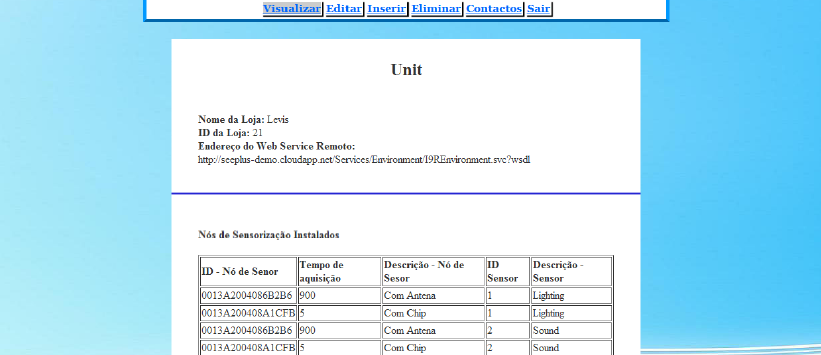
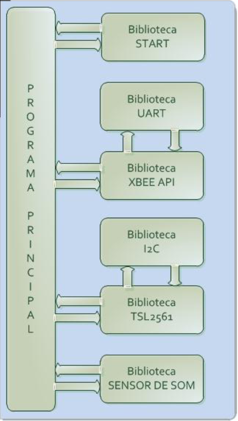
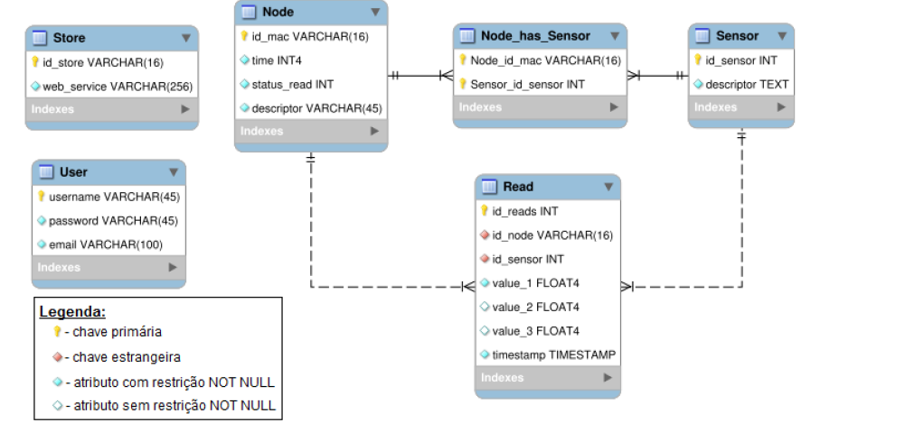

## Synopsis

Distributed Sensor Network using Digi ZigBees .  
The Node Cards gathers manages the gathering of information and forming the message to send to the concentrator.  
Several Sensors are used, namely luminosity sensor (tsl2561), SPL sensor, etc .  
The message is received by the concentrator that stores into a database.

 
## Features 

Many sensors can be added into the node and many similar nodes can be used simultaneously.

## Videos/Images

Database Transaction.  

Node Code Diagram.  

Database Model.  

## Contributors

Main Developer :HSO  
Email: hugo(dot)soares(at)fe(dot)up(dot)pt 
